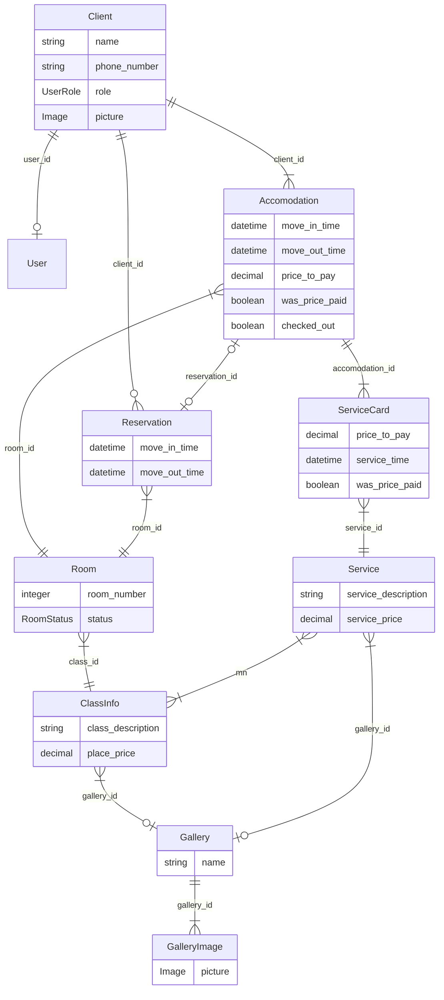

# About

This app is an implementation (both backend and frontend) of a hotel management system, allowing you to manage clients, staff, hotel rooms, classes, services, accomodations, reservations, etc.

# Images


# Deployment

To deploy the app you need to create the following files in the root directory based on their .example counterparts: `.env` and `local_settings.py`.  
Fill in all of the variable values in .env. To generate DJANGO_SECRET_KEY use the following bash command:  
```bash
python -c "from django.core.management.utils import get_random_secret_key; print(get_random_secret_key())"
```
You should also put your domain name in local_settings.py into the variable `CSRF_TRUSTED_ORIGINS`.  

You might also want to layer some of the project files in the layer directory. For example, you can put custom `favicon.ico` file in `layer/frontend/public/favicon.ico`.  
After all that use podman/docker compose to start the app:  
```bash
sudo docker compose build
sudo docker compose up -d
```

The service will be accessible at the port `HOTEL_MS_PORT`.  
You'll be able to login as the superuser with the credentials in the DJANGO_SUPERUSER_* variables.

# Technical

The backend is implemented in python and django and is located in the `backend` directory.  
The frontend is implemented in typescript and vue and is located in the `frontend` directory.  
The following database is used:  

